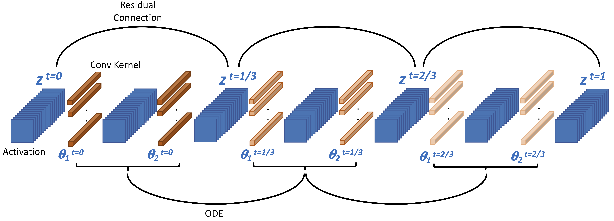
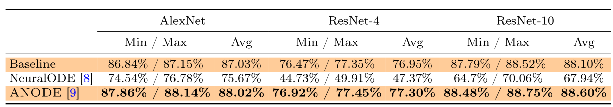

   


# ANODE: Adjoint Based Neural ODEs
ANODE is a neural ODE framework based on [this paper](https://arxiv.org/pdf/1902.10298.pdf).
It provides unconditionally accurate gradients for Neural ODEs, using adjoint method. It also
uses checkpointing to enable testing with large time steps without compromising accuracy in gradient computations.


# Examples
The main driver for ANODE is train.py file. It provdies command line options to test with different configurations.
An example use case to test with ResNet is:

```
python3 train.py --network resnet
```

Similarly to test with SqueezeNext you can use:

```
python3 train.py --network sqnxt
```

Key command line options include:

- `network` Network structure to use. Currently we support ResNet and [SqueezeNext](https://github.com/amirgholami/SqueezeNext)
- `method` Specifies the discretization method to use for solving ODE. We currently support Euler, RK2, and RK4 methods
- `Nt` Number of time steps to use for solving ODE
- `lr` Value of leraning rate


# Comparison with Neural ODE
ANODE computes the correct gradient information, whereas the approach presented in [Neural ODE](https://arxiv.org/pdf/1806.07366.pdf)
may suffer from numerical instability associated with solving forward ODE backwards in time. Below are the comparison
on three networks of AlexNet, ResNet-4, and Resnet-10 on Cifar-10. For more details please see [this paper](https://arxiv.org/pdf/1902.10298.pdf).


   

   
Comparison of ANODE and [Neural ODE](https://arxiv.org/abs/1806.07366) using RK-2 discretization method on Cifar-10 using SqueezeNext model.
ANODE converges to lower training loss and higher testing accuracy, since it computes unconditionally accurate gradients whereas
the Neural ODE approach may suffer from numerical instability associated with solving forward ODE, backwards in time.
For more details please see [this paper](https://arxiv.org/pdf/1902.10298.pdf).


# Reference
If you found this code useful, we appreciate it if you could please cite the following papers:

- Amir Gholami, Kurt Keutzer, and George Biros, *ANODE: Unconditionally Accurate Memory-Efficient Gradients for Neural ODEs*, International Joint Conferences on Artificial Intelligence (IJCAI'19), 2019.
- Zhang, Tianjun, Zhewei Yao, Amir Gholami, Kurt Keutzer, Joseph Gonzalez, George Biros, and Michael Mahoney. *ANODEV2: A Coupled Neural ODE Evolution Framework*, arXiv preprint arXiv:1906.04596 (2019).
